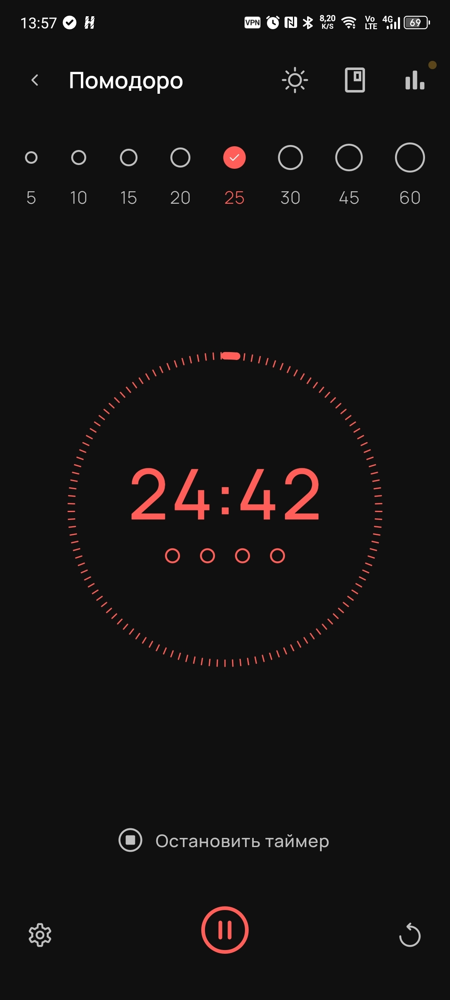
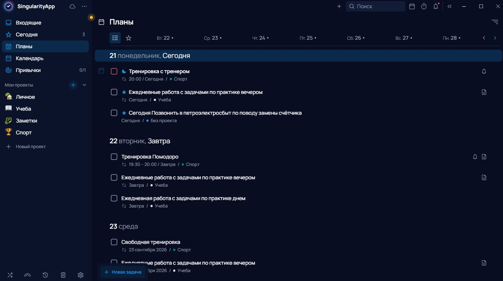
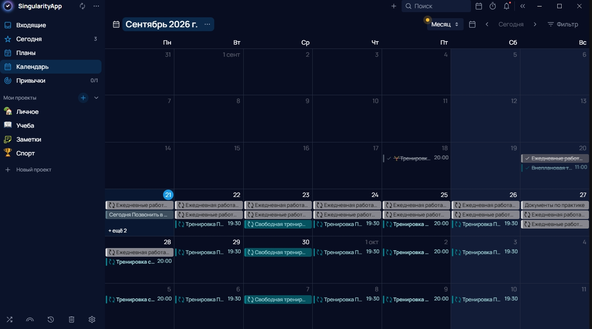
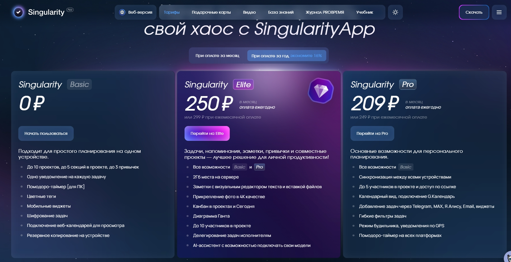

# SingularityApp: честный обзор за полторы недели использования
Я тестировал SingularityApp примерно полторы-две недели. За это время у меня был доступ к платной подписке по пробному периоду, так что я успел попробовать не только бесплатную версию. Использовал приложение для двух вещей: задания по практике и личные бытовые дела — расписание тренировок, походы в магазин, оплата услуг и т.п.

## Что вообще такое Singularity и зачем оно
Singularity — это планировщик, который пытается быть «всем сразу»: список задач, календарь, заметки, трекер привычек, таймер Помодоро. Работает на телефоне (Android/iOS), на компьютере (Windows/macOS/Linux), есть веб-версия

Приложение заявлено как кроссплатформенное: iOS, Android, Windows, macOS, Linux, веб-версия и даже умные часы. Это важно, потому что я постоянно переключаюсь между телефоном и рабочим ПК.

Кому будет полезно: тем, кто любит структуру, проекты с подзадачами, теги и хочет держать всё в одном месте.

Кому не зайдёт: если вам нужен простой «список покупок и пара напоминалок» — тут слишком много всего.

## Как я использовал приложение: реальные результаты

### Практика и задания
Первое, что я сделал, это сделал ежедневное задачу, сроком до конца практики, чтобы два раза в день по несколько часов выполнять задания. Я не стал разделять практические задания на отдельные задачи, также не стал разбивать каждую задачу на отдельные подзадачи т.к. поссчитал это не очень нужным для этих задач. Это задача в рассписании скорее работала как мотивация ежедневно работать над заданиями по практике. 

### Личные и бытовые задачи

В личные задачи я запихивал все, что угодно. Во-первых, сделал проект "Личное" И заносил туда все повседневные задачи, от похода в магазин и уборки, до более серьезных задач по типу встреч и поездок. Во-вторых,я сделал отдельный отдельный проект для спорта. Там было полное расписание тренировок, домашние тренировки, а также я заносил туда внеплановые тренировки.

### Заметки

Был сделан отдельны проект для заметок. Удобно записывать какие-то мелочи из различных сфер жизни.

### Таймер Помодоро — для домашних тренировок

Вот это неожиданно понравилось. Я использовал Помодоро не для работы, а для маленьких домашних тренировок. Логика простая: ставишь таймер на 25 минут, делаешь зарядку/упражнения, потом 5 минут отдыха. Тренировка не превращается в «час мучений», а разбивается на управляемые куски. Плюс таймер встроен прямо в карточку задачи — не надо запускать отдельное приложение.

### Telegram-бот

Это, пожалуй, самая полезная штука за пределами самого приложения. Суть: ты пишешь боту в Telegram — и это автоматически становится задачей в Singularity. Не надо открывать приложение, не надо переключаться. Просто отправь боту сообщение, первая строка станет названием задачи, остальные строки — описанием. Бот понимает естественный язык. Можно написать «завтра в 18:30», «в пятницу вечером», «через 3 дня» — и он сам поставит дату . Если даты нет, задача уйдёт во «Входящие». Чтобы добавить задачу в проект, пиши `//НазваниеПроекта`. Для тега — `#тег` . Например: «Купить молоко //Дом #Покупки».  

Важно: бот работает только на тарифах Pro или Elite . У меня был пробный период платной подписки, так что я успел попробовать.

### Итог по личному использованию

Такой подход позволял лучше планировать и структурировать не только свой день, но и видеть загруженность других дней. Также это приложение очень спасало, когда в процессе работы, тебе ставят какие-то мелкие задачи, о которых, ты можешь через какое-то время забыть, но благодаря этому сервису ты сразу записываешь задачу и в последствие выполняешь ее.

## Достоинства: что реально понравилось

1. Всё в одном месте. Задачи, календарь, привычки, Помодоро — не надо прыгать между пятью приложениями. Это экономит время и нервы.

2. Гибкая система тегов и проектов. Можно раскидать дела по контекстам: «Практика», «Быт», «Здоровье». И фильтровать. Звучит просто, но на практике реально помогает не утонуть в списке.

3. Способы добавления задач. Голосом, через виджет, через Telegram-бота, по email — вариантов много . Я чаще всего пользовался ботом и виджетом на телефоне.

4. Интерфейс приятный. Тёмная тема, аккуратные иконки, анимации при выполнении задач. Не «бухгалтерская программа из 90-х», а что-то современное.

5. Помодоро встроен в задачи. Не надо запускать отдельное приложение. Открыл задачу — запустил таймер — работаешь. Для домашних тренировок это оказалось идеально.

6. Есть синхронизация с Google Календарём. Я ей не пользовался, но функция заявлена: двусторонняя, то есть задачи из Singularity появляются в Google Calendar и наоборот . Для тех, кто живёт в календаре — это большой плюс.

## Недостатки: что бесило

1. Синхронизация — самая частая жалоба. В отзывах пишут: «синхронизация между устройствами какая-то кривая, у меня 2 телефона и компьютер, если что введу на одном устройстве, то на одном из других ничего не отобразится» . У меня было мягче — обычно всё сходилось за пару секунд, но пару раз задача, отмеченная выполненной на телефоне, оставалась висеть на компьютере. Раздражает, когда планируешь день.

Разработчики отвечают, что проблемы «локальные, связанные с внешними системами» . Возможно. Но осадочек остался.

2. Многое за деньги. Бесплатная версия работает только на одном устройстве. Для меня это сразу означает: либо плати, либо пользуйся только телефоном. Синхронизация — базовая функция для современного планировщика, и прятать её за подписку — спорное решение.

3. Интерфейс местами перегружен. Настроек и кнопок реально много. Первую дни я пытался разобрать во всем многообразии функций и пытался понять, где что.

## Удобство и эффективность: общий итог

### Удобство

Телефонная версия удобнее компьютерной. Голосовой ввод, виджеты, Telegram-бот — всё это реально экономит время. Но синхронизация и перегруженность настроек иного напрягают

### Эффективность

Если закрыть глаза на технические шероховатости, Singularity реально помогает делать дела. Встроенный Помодоро, чёткая структура, теги — всё это работает. Проблема не в инструменте, а в том, что за эффективные функции надо платить.

### Соотношение цена/качество

Платные тарифы стоят от 209–250 ₽/мес при оплате за год. Нормально, если пользуешься всем. Но если нужна только синхронизация задач — это дорого.

## Вывод 

Singularity — мощный инструмент для тех, кто готов в него погрузиться. Если вы любите порядок, проекты с подзадачами и хотите «всё в одном» — попробуйте бесплатный тариф. Если зайдёт, платите за Pro. Если вам нужен просто «список дел с напоминалками», то это приложение не совсем для вас, но с этими задачами тоже справится.

Кому рекомендую: студентам с кучей дедлайнов, фрилансерам, людям, которые уже пробовали методику GTD (Getting Things Done).

Кому не рекомендую: тем, кто хочет бесплатную синхронизацию между устройствами или ненавидит копаться в настройках.