# VS Code как инструмент работы с Git

## Введение

В данной работе я расскажу о возможностях Visual Studio Code (VS Code) как инструмента для работы с Git. VS Code — это редактор кода от Microsoft, который имеет встроенную поддержку Git и не требует установки отдельных Git-клиентов вроде GitHub Desktop, Sourcetree или GitKraken.

Я выбрал именно VS Code по нескольким причинам. Во-первых, я уже знаком с этим редактором и работал в нем раньше. Во-вторых, VS Code позволяет работать с Git прямо в том же окне, где я пишу код — не нужно переключаться между редактором и отдельной программой. В-третьих, VS Code сочетает в себе и графический интерфейс (кнопки, панели), и доступ к терминалу, что дает гибкость: можно делать операции мышью, сочетанием клавишь, а можно вводить команды руками.

В работе я расскажу, какое программное обеспечение нужно установить и настроить для работы с Git, покажу основные базовые команды Git и как они выполняются через интерфейс VS Code, продемонстрирую работу с локальным и удаленным репозиторием, работу с ветками и слиянием, а также опишу особенности VS Code как Git-клиента.

## 1. Подготовка рабочего окружения

### 1.1. Установка Git

VS Code — это только оболочка. Чтобы работать с Git, сначала нужно установить сам Git в систему. Без него кнопки в панели Source Control в VS Code будут неактивны.

Я скачал установщик Git с официального сайта https://git-scm.com/ и запустил его. При установке я оставил большинство настроек по умолчанию, но изменил два параметра. Во-первых, в качестве редактора по умолчанию для Git я выбрал Visual Studio Code. Это нужно для того, чтобы, когда Git потребует ввести текст (например, сообщение коммита), открывалось знакомое окно VS Code, а не консольный редактор Vim. Во-вторых, я изменил имя начальной ветки с `master` на `main`. Это сделано потому, что `main` — современный стандарт, который используется на GitHub по умолчанию. Если локально ветка называется `master`, а на GitHub — `main`, при первой отправке кода возникнет путаница. Чтобы этого избежать, я сразу настроил `main`.

### 1.2. Проверка установки Git

После установки я открыл VS Code, вызвал встроенный терминал через сочетание `Ctrl + J` (можно через меню Terminal → New Terminal) и ввел команду `git --version`. Эта команда показывает, какая версия Git установлена и видит ли ее система.

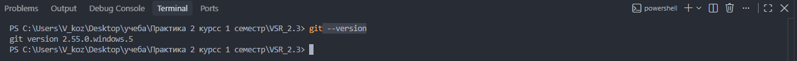

### 1.3. Настройка Git

После установки Git нужно представиться — указать имя и email. Эти данные будут прикрепляться к каждому коммиту, чтобы было понятно, кто его сделал.

В терминале VS Code я выполнил две команды:

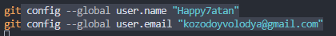

Затем проверил, что настройки сохранились:

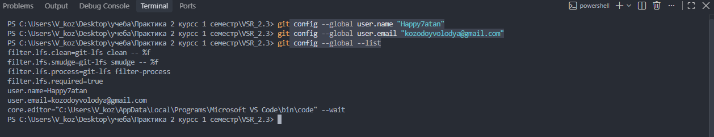

### 1.4. Установка расширения GitLens

VS Code имеет встроенную поддержку Git, но для более наглядной работы с историей я установил расширение GitLens. Оно показывает, кто и когда менял каждую строку кода, строит граф коммитов и позволяет сравнивать версии файлов.

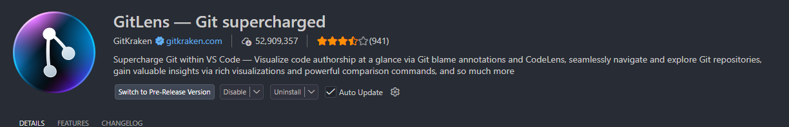

## 2. Что умеет VS Code при работе с Git

VS Code предоставляет доступ к Git через панель Source Control. Открыть ее можно через иконку ветвления на левой боковой панели или сочетанием клавиш `Ctrl + Shift + G`.

Все основные команды Git можно выполнить двумя способами: через кнопки в панели Source Control или через встроенный терминал. Ниже я опишу каждую команду и то, что она делает.

`git init` — создает новый Git-репозиторий в текущей папке. В VS Code это делается кнопкой Initialize Repository в панели Source Control. После этого в папке появляется скрытая директория `.git`, где хранится вся история.

`git clone` — копирует существующий удаленный репозиторий на компьютер. В VS Code это делается через Command Palette (`Ctrl + Shift + P`) → Git: Clone, после чего нужно вставить ссылку на репозиторий.

`git status` — показывает, какие файлы изменены, какие добавлены в индекс, а какие еще не отслеживаются. В VS Code это видно автоматически: в панели Source Control отображается список измененных файлов.

`git add` — добавляет файл в индекс (staging area), то есть помечает его как готовый к коммиту. В VS Code это делается кнопкой «+» рядом с файлом. В терминале — `git add имя_файла` или `git add .` для всех файлов.

`git commit` — сохраняет изменения из индекса в историю репозитория. В VS Code нужно ввести сообщение в поле ввода и нажать кнопку «✓ Commit». В терминале — `git commit -m "сообщение"`.

`git push` — отправляет локальные коммиты на удаленный репозиторий (например, на GitHub). В VS Code это кнопка Sync Changes. В терминале — `git push`.

`git pull` — забирает изменения с удаленного репозитория и применяет их локально. В VS Code — тоже Sync Changes или через меню «...» → Pull. В терминале — `git pull`.

`git branch` — показывает список веток или создает новую. В VS Code текущая ветка видна в статус-баре внизу слева. Клик по ней открывает список веток и позволяет создать новую.

`git checkout` — переключает на другую ветку. В VS Code — клик по имени ветки в статус-баре и выбор нужной. В терминале — `git checkout имя_ветки`.

`git merge` — сливает одну ветку в другую. В VS Code — Command Palette → Git: Merge Branch. В терминале — `git merge имя_ветки`.

`git log` — показывает историю коммитов. В VS Code с расширением GitLens история видна в боковой панели GitLens. В терминале — `git log --oneline --graph --all`.

`git diff` — показывает разницу между версиями файла. В VS Code достаточно кликнуть по измененному файлу — откроется встроенный diff-редактор с подсветкой: красным удаленные строки, зеленым добавленные.

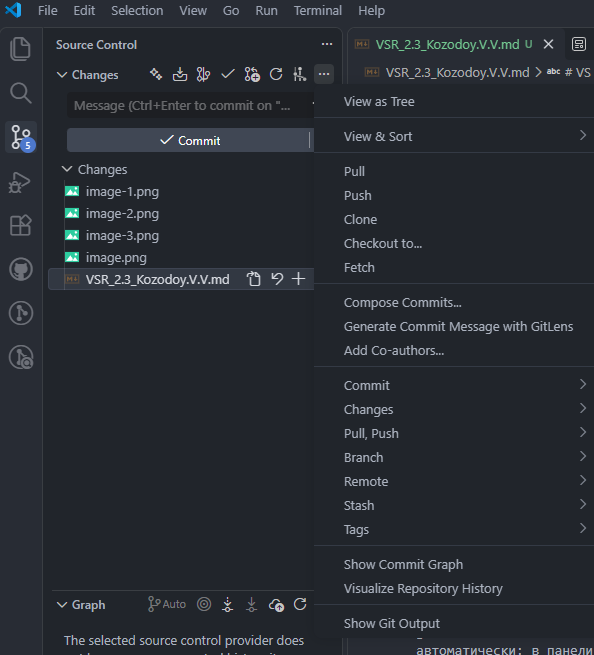

## 3. Практическая демонстрация команд

В этом разделе я показываю выполнение основных команд Git. Все команды я ввожу вручную во встроенном терминале VS Code. VS Code при этом автоматически отображает результат этих команд в своем интерфейсе — в панели Source Control, в статус-баре и в редакторе. Это одна из ключевых особенностей инструмента: ты работаешь в терминале, но видишь все изменения в графическом интерфейсе.

### 3.1. Создание локального репозитория

Я создал на рабочем столе папку git-practice, открыл ее в VS Code. Затем открыл встроенный терминал и ввел команду `git init`:

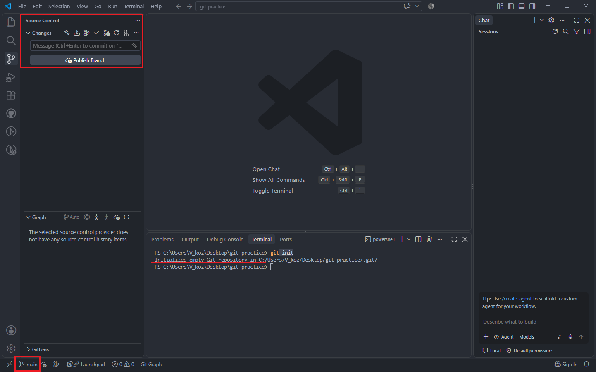

Команда создала в папке скрытую директорию `.git`. В терминале появилось сообщение `Initialized empty Git repository in C:/Users/V_koz/Desktop/git-practice/.git/`. При этом в левой панели VS Code автоматически появилась иконка Source Control, а в статус-баре внизу слева — имя ветки `main`.

### 3.2. Проверка состояния репозитория

Прежде чем что-то делать, я проверил состояние репозитория командой `gi status`:

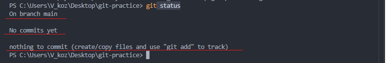

Терминал вывел: `On branch main`. `No commits yet`. `nothing to commit (create/copy files and use "git add" to track)`. Это значит, что репозиторий пуст — ни одного коммита, ни одного отслеживаемого файла.

### 3.3. Создание файла и первый коммит 

Я создал в папке файл `README.md` с текстом `# Практика по Git`. После сохранения файла я снова ввел `git status` — терминал показал, что появился неотслеживаемый файл `README.md` (Untracked files).

Затем я добавил файл в индекс и закоммитил его двумя командами: `git add README.md`, `git commit -m "Первый коммит: добавлен README"`.

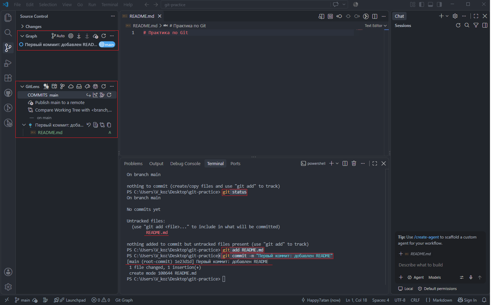

После `git commit` в терминале появилось сообщение `[main (root-commit) 1e23d1d] Первый коммит: добавлен README`, а в панели GitLens появился раздел COMMITS main с первым коммитом «Первый коммит: добавлен README» и меткой ветки `main`. Под коммитом виден файл `README`.md с пометкой `A` (Added — добавлен). Также и в панели Git Graph отображается первый коммит `«Первый коммит: добавлен README»` с меткой ветки `main`. Под коммитом виден файл `README.md` с пометкой `A` (Added — добавлен).

### 3.4. Просмотр истории 

Чтобы убедиться, что коммит создан, я ввел `git log --oneline`:

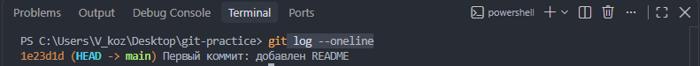

Терминал вывел одну строку т.к. использовалсяс флаг `--oneline`: `1e23d1d (HEAD -> main) Первый коммит: добавлен README`. Это значит, что в истории один коммит, и ветка main указывает на него. Без флагов `git log` выводит подробно: хеш, автор, дата, сообщение.

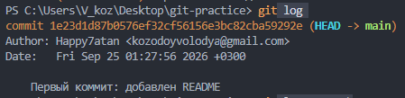

### 3.5. Создание новой ветки

Я создал новую ветку командой `git branch feature-1`. Команда не вывела никакого сообщения — это нормально, проверка через `git branch` показала, что появилась ветка `feature-1`, но символ `*` стоит на `main` — значит, мы остались на прежней ветке.

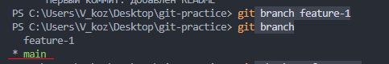

Затем я переключился на новую ветку командой `git checkout feature-1`. Терминал вывел `Switched to branch 'feature-1'`. В статус-баре VS Code внизу слева имя ветки сменилось с main на feature-1. Повторная проверка через `git branch` показала, что звездочка теперь стоит на `feature-1`.

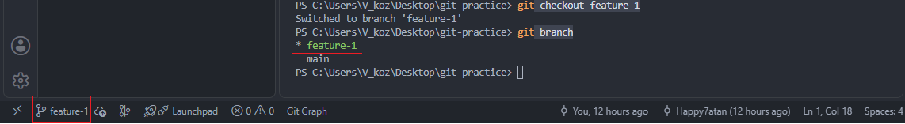

### 3.6. Изменения в ветке и коммит

Находясь на ветке `feature-1`, я изменил файл `README.md`. Команда `git status` подтвердила, что файл изменен: в выводе было указано `On branch feature-1` и `modified: README.md`.

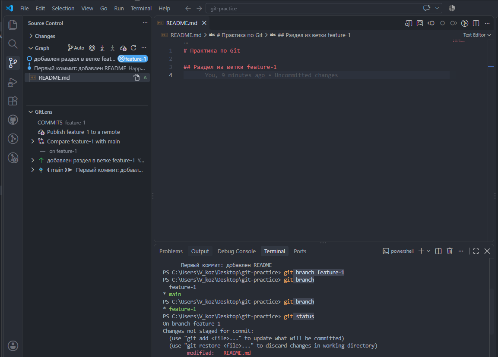

Затем я добавил файл в индекс командой `git add README.md` и закоммитил командой `git commit -m "добавлен раздел в ветке feature-1"`. Терминал вывел `[feature-1 f4240c0] добавлен раздел в ветке feature-1` и `1 file changed`, `3 insertions(+)`, `1 deletion(-)`. В квадратных скобках указана ветка `feature-1`, что подтверждает: коммит ушел именно в эту ветку, а не в main.

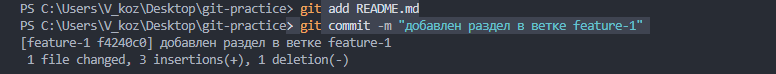

Проверка через `git log --oneline --graph --all` показала, что ветки разошлись. Ветка `main` осталась на коммите 1e23d1d («Первый коммит: добавлен README»), а ветка feature-1 ушла на один коммит вперед — f4240c0 («добавлен раздел в ветке feature-1»).

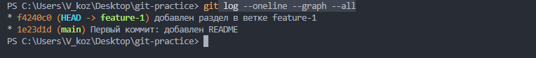

### 3.7. Слияние ветки

Я переключился обратно на ветку `main` командой `git checkout main`.

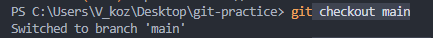

Затем я слил ветку `feature-1` в `main` командой `git merge feature-1`. Терминал вывел:

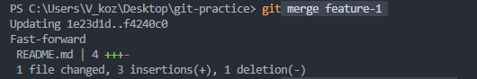

Слияние прошло в режиме Fast-forward — это значит, что Git просто переместил указатель `main` вперед, на коммит `feature-1`. Отдельный коммит слияния не создавался, потому что в `main` не было своих коммитов после ответвления `feature-1`.

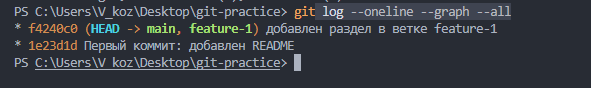

Проверка через `git log --oneline --graph --all` показала, что обе ветки — `main` и `feature-1` — теперь указывают на один и тот же коммит ` f4240c0`. Это подтверждает, что слияние выполнено успешно.

### 3.8. Подключение удаленного репозитория

Я создал новый пустой репозиторий на GitHub с именем `git-practice` (без README, .gitignore и лицензии, чтобы не создавать конфликтов с локальным репозиторием). Затем в терминале VS Code я привязал удаленный репозиторий к локальному командой `git remote add origin https://github.com/Happy7atan/git-practice.git`. После нее я ввел в терминал команду `git remote -v` и терминал вывел `origin  https://github.com/Happy7atan/git-practice.git (fetch)`, `origin  https://github.com/Happy7atan/git-practice.git (push)`. Это значит, что удаленный репозиторий привязан.

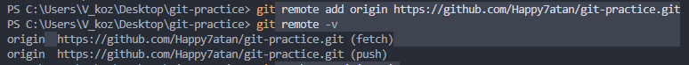

Затем я отправил код на GitHub командой `git push -u origin main`. Я использовал флаг `-u`. Без него при каждом push пришлось бы писать полностью: `git push origin main`. С флагом `-u` Git запоминает, что локальная ветка main связана с удаленной origin/main, и дальше достаточно `git push` или `git pull` без аргументов. VS Code открыл браузер для авторизации на GitHub — я разрешил доступ. Терминал вывел информацию об отправке объектов и строку branch `'main' set up to track 'origin/main'`, что означает успешную отправку и установку связи между локальной и удаленной ветками.

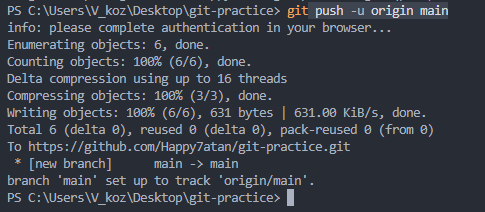

После обновления страницы репозитория на GitHub я увидел файл README.md и оба коммита — «Первый коммит: добавлен README» и «добавлен раздел в ветке feature-1».

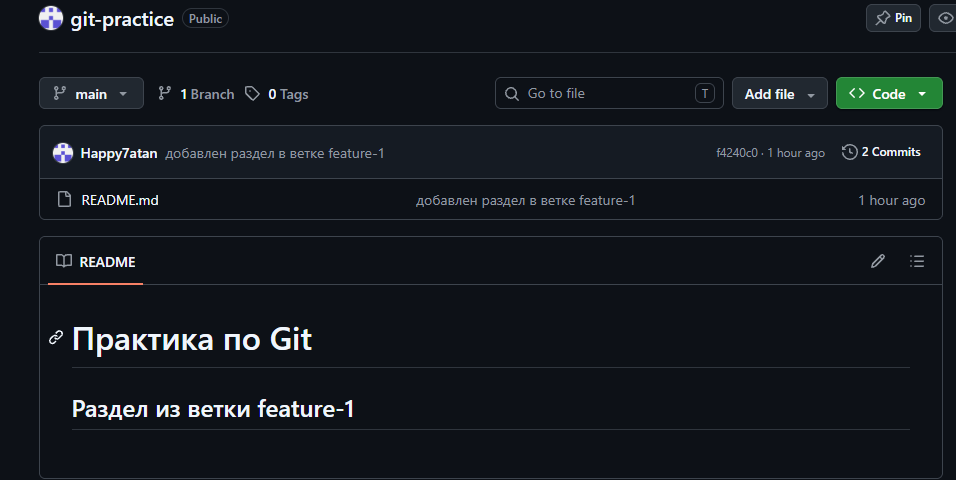

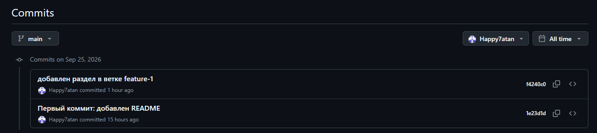

### 3.9. Получение изменений

Чтобы продемонстрировать работу команды git pull, я сначала внес изменение в файл README.md в удаленный репозиторий напрямую через веб-интерфейс GitHub. В нем я добавил строку `## Изменение с GitHub` и закоммитил изменение с сообщением «Добавлена строка через веб-интерфейс GitHub».

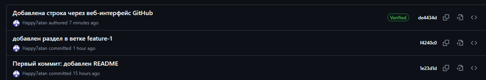

Затем я вернулся в VS Code и проверил локальную историю командой `git log --oneline` — там было только два коммита, то есть изменение с GitHub еще не было получено локально. Это подтвердило, что локальная и удаленная версии разошлись. Чтобы получить изменения, я ввел команду `git pull`

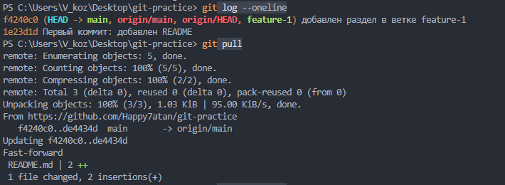

Терминал вывел информацию о получении объектов `remote: Enumerating objects, Unpacking objects`, строку `f4240c0..a1b2c3d main -> origin/main` и результат слияния `Fast-forward`, а также `1 file changed`, `1 insertion(+)`. Это значит, что изменение с GitHub было успешно получено и применено к локальному файлу.

После этого команда `git log --oneline` показала уже три коммита, причем main и origin/main указывали на новый коммит de4434d — синхронизация восстановлена.

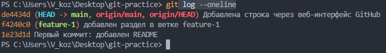

### 3.10. Разрешение конфликта

Для демонстрации разрешения конфликта я изменил одну и ту же строку файла `README.md` в двух местах по-разному. Локально я изменил заголовок на `# Практика по Git (локально)` и закоммитил изменение с сообщением «Изменен заголовок локально». На GitHub через веб-интерфейс я изменил ту же строку на `# Практика по Git (GitHub)` и закоммитил с сообщением «Изменен заголовок на GitHub». Затем я выполнил команду `git pull`

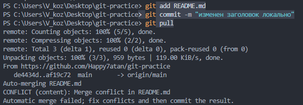

Терминал вывел `Auto-merging README.md`, затем `CONFLICT (content): Merge conflict in README.md` и `Automatic merge failed; fix conflicts and then commit the result`. Это значит, что Git не смог автоматически решить, какую версию строки оставить, и передал решение мне. VS Code автоматически обнаружил конфликт и открыл встроенный merge-редактор. Файл содержал маркеры конфликта:

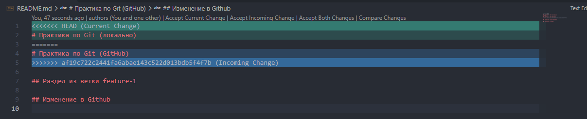

Над конфликтующим блоком VS Code показал кнопки `Accept Current Change`, `Accept Incoming Change`, `Accept Both Changes` и `Compare Changes`. Я нажал `Accept Both Changes`, чтобы оставить обе версии строки. Маркеры конфликта исчезли, файл сохранился. Затем я добавил файл в индекс и закоммитил разрешение конфликта, а также отправил изменения на GitHub.

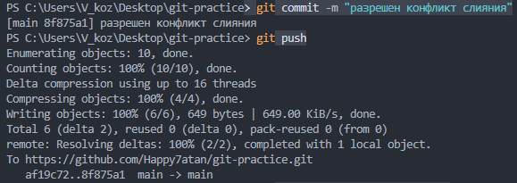

Проверка через `git log --oneline --graph --all` показала нелинейный граф с разветвлением и точкой слияния — это подтверждает, что конфликт был разрешен и слияние выполнено.

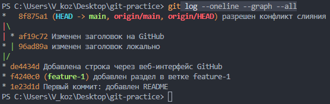

## 4. Заключение 

Visual Studio Code — удобный инструмент для работы с Git, объединяющий редактор кода и графический интерфейс системы контроля версий в одном окне. Встроенная поддержка Git не требует установки дополнительных клиентов: все основные операции — от инициализации репозитория до слияния веток и разрешения конфликтов — доступны как через панели и кнопки, так и через встроенный терминал.

Ключевая особенность VS Code — визуализация работы с Git. Панель Source Control показывает состояние репозитория в реальном времени, встроенный diff-редактор сравнивает версии файлов с подсветкой изменений, а при конфликтах слияния открывается интерактивный merge-редактор с кнопками выбора версии. Интеграция с GitHub выполняется через авторизацию в браузере, а Git Credential Manager сохраняет учетные данные. Расширения GitLens и Git Graph добавляют работу с историей: авторство строк, граф коммитов, сравнение веток.

Сочетание графического интерфейса, терминала и расширений делает VS Code универсальным инструментом, который подходит как для базовых операций, так и для сложных сценариев. Разработчику не нужно переключаться между разными приложениями — все задачи решаются в едином окне.

